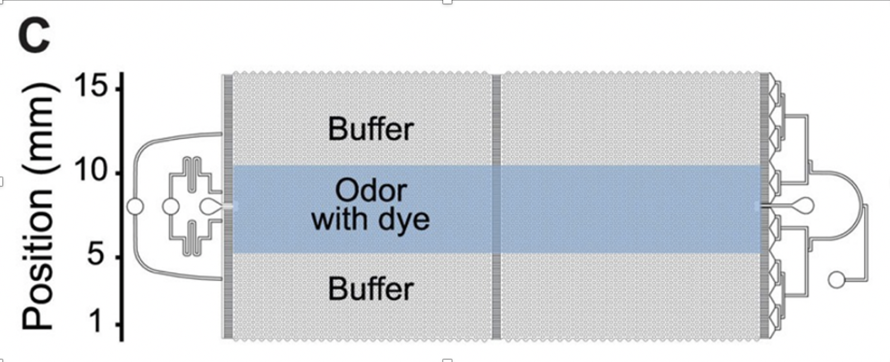

# INPBootCamp: behavior

## Analysis of behavioral data using C. elegans and MATLAB 

The purpose of this module is to familiarize students with behavioral tracking data, how they can analyze time series data of this type, and how to plot corresponding trends in behavioral phenotypes. 

The dataset from which we will work is from [Khan et al., PLOS Bio 2022](https://doi.org/10.1371/journal.pbio.3001677). C. elegans are attracted to or repelled by different odors and the olfactory neurons required for these behavioral responses are known for a large number of odorants. In this work, we showed that contextual cues can switch the behavioral response to alcohols like hexanol and heptanol from attraction to repulsion. The contextual cue in this case is a uniform concentration of another attractive chemical (either Isoamyl alcohol or benzaldehyde). These behaviors can be measured by recording worms in microfluidics behavioral arenas in which a spatial stripe of a candidate odorant is presented (See figure 1C from Khan et al., below). 



Students will have access to datasets derived from videotracking of worms (approx. 20-30/assay) over 20 minutes. These data will be in .csv format ("all_matTrack_data.csv") with centroid position (x, y), time and assigned behavioral “states”. Additionally, there is a separate .csv ("luminance.csv"), which contains the luminance values in the arena (vertical axis in the figure), for every frame in the video files (2400 frames, in this case).

Folder organization is shown below:

```
Figure
    |__genotype (2 or 3 per figure)
              |__assay (at least 3 per genotype)
                    |__all_matTrack_data.csv
                    |__luminance.csv
```
To start, this repository can be either manually downloaded, or using git:

```git clone https://github.com/ODonnellLab/INPBootCamp.git```

Example scripts to load in and do some basic plotting are available in ./scripts

Introductory students should import data into MATLAB, and plot histograms of the residence (relative proportion of tracked worms per spatial bin) from wild-type worms exposed to hexanol and isoamyl alcohol saturated hexanol, as shown in Figure 1D. These students can also plot the individual worm tracks during the assay. 

Intermediate students can plot data from mutants (1D) and compare the relative proportion of time spent in the stripe relative to the non-stripe region to generate a chemotaxis index (Number in odorant - number outside / (total number)), for each of 3 independent assays per condition. 

More experienced students can determine if chemotaxis index varies by time, or if specific behavioral states are overrepresented in a specific mutant background, either using provided behavioral states or via algorithmic identification of states (e.g. a change in direction indicates a 'turn')
